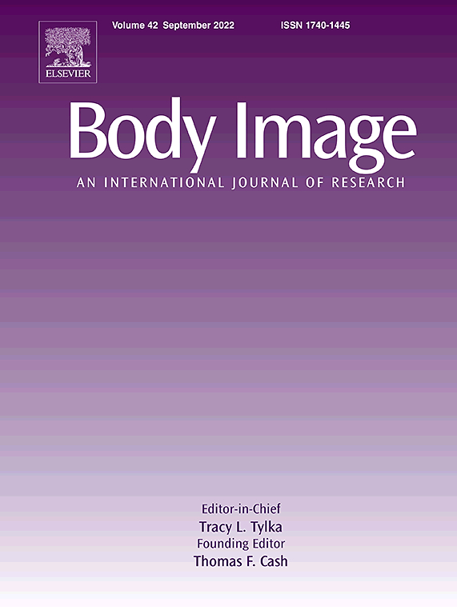
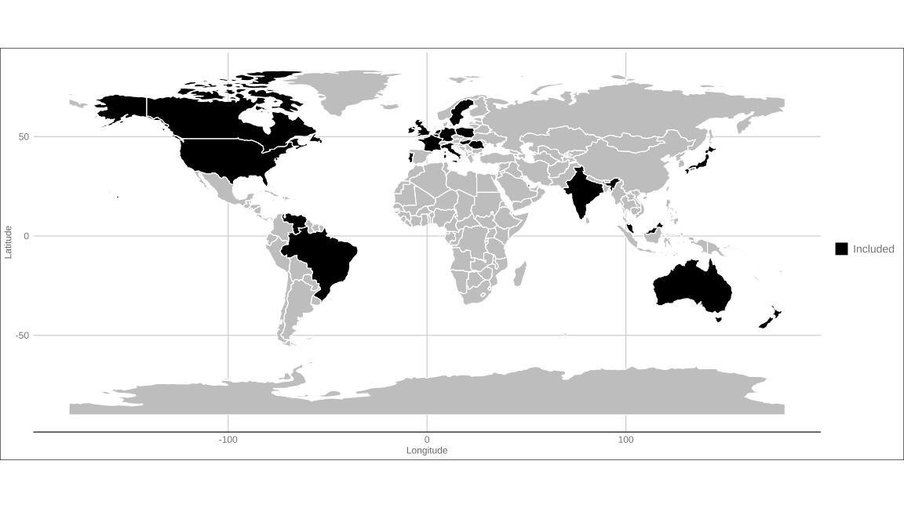
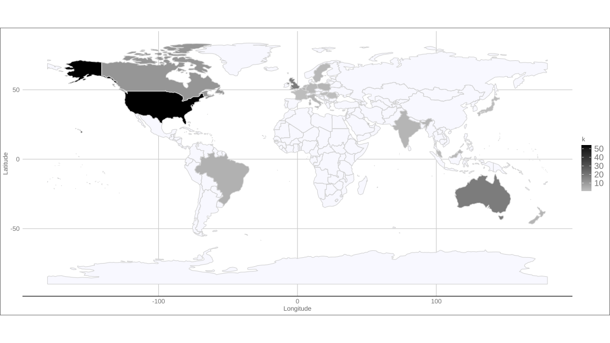
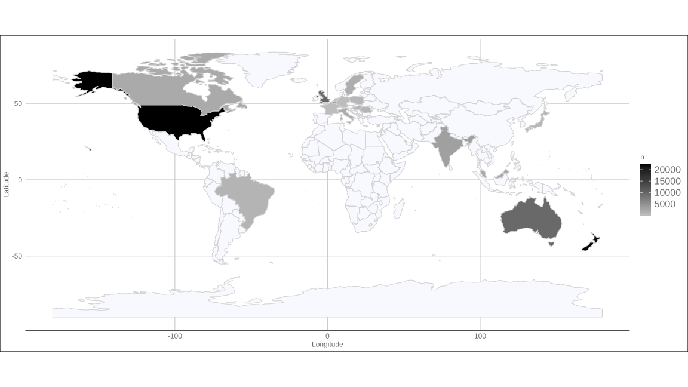
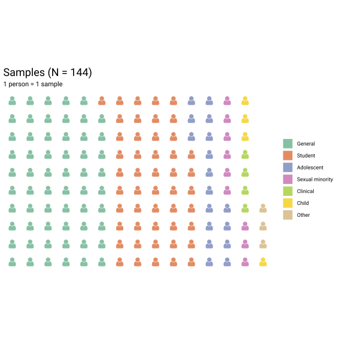
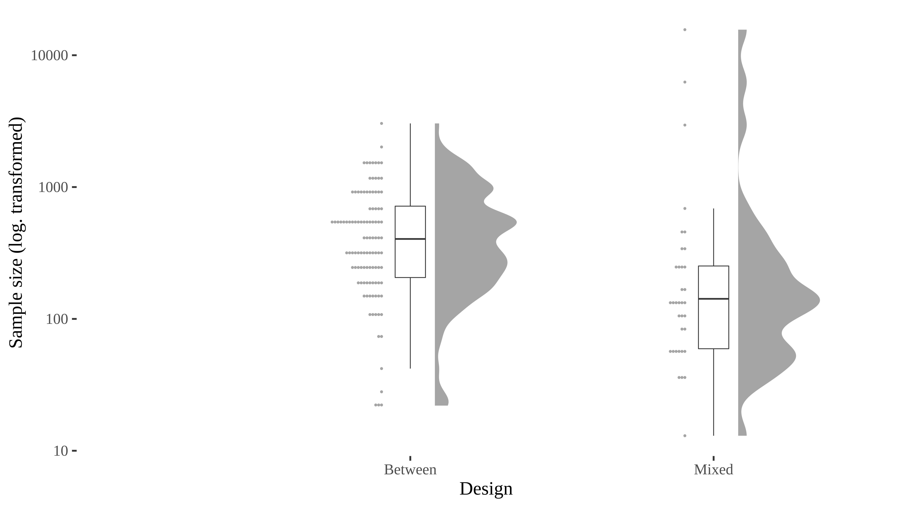

```{r setup, include=FALSE}
options(htmltools.dir.version = FALSE)
knitr::opts_chunk$set(echo = TRUE)
```

```{r echo=F, message=F, warning = F}
require(xaringanExtra) 
require(stargazer)
require(tidyverse)
require(knitr)
```

```{r xaringan-logo, echo=FALSE}
xaringanExtra::use_logo("NU2.png")
```

```{r xaringan-tile-view, echo=FALSE}
xaringanExtra::use_tile_view()
# Below generates a new class of simulation table, as otherwise it will not fit.
```

```{css, echo = F}
table {
  font-size: 16px;     
}
```

```{css, echo = F}
.simulation table {
  font-size: 7px;     
}
```


## Today

* Work in progress.

* Largely descriptive project.

```{r, out.width = "400px", echo=FALSE, fig.align='center'}
knitr::include_graphics("https://media.giphy.com/media/n6ljtq0aO6Zqg/giphy.gif") 
```

---
## Movement towards meta-science.

* Replication crisis in Psychology

--

* Describing the samples we use. 

--

--> Recurrent criticism that psychology relies on student samples (e.g., [Thalmayer et al. 2020](https://doi.org/10.1037/amp0000622))

--

--> W.E.I.R.D. : Western Educated Industrialised Rich and Democratic

--

--> External validity - [measurement crisis](https://doi.org/10.1177/2515245920952393)

--

--> ['Power failure'](https://doi.org/10.1038/nrn3475)

--

Previous project on samples used in [Evolution and Human Behaviour and Evolutionary Psychology](https://link.springer.com/article/10.1007/s40806-019-00192-2).

???
70% Online or student samples / >80% from 'Western' countries (Europe, USA/CAN/AUS)

---
## Sampling

A closer look at the samples being used.

--

Descriptive project

--

* Are samples different from general population in terms of age?

* Are samples different from general population in terms of BMI?

```{r, out.width = "200px", echo=FALSE, fig.align='center'}
knitr::include_graphics("https://media.giphy.com/media/3orieOSgDeu3pHrFIY/giphy.gif") 
```

---
## Methodology.

* All papers from 2021 from _Body Image_ (n = 137).

* 148 samples (5 meta-analyses or content analyses not analysed further).

```{r, out.width = "300px", echo=FALSE, fig.align='center'}
 # See Elsevier web page
```

---
## Methodology: Coding

* Type of paper (Quant. or not)

--

* Type of design (Between, Mixed, Within)

--


* Country (incl. multi-country)

--


* Type of sample: "General Population", Student, Other

--

* Sample characteristics (Age, Majority Ethnicity, Gender)

--

* BMI (Mean/SD - how measured)

```{r, out.width = "250px", echo=FALSE, fig.align='center'}
knitr::include_graphics("https://media.giphy.com/media/8vOF5hcAuSa6BkBWFD/giphy.gif") 
```

???
Sample type based on majority

---
## Methodology: Statistical power

* [Cohen (1988)](https://scholar.google.com/scholar?as_q=&as_epq=Statistical%20power%20for%20the%20social%20sciences&as_occt=title&as_sauthors=J+Cohen&as_ylo=1988&as_yhi=1988&as_sdt=1.&as_sdtp=on&as_sdtf=&as_sdts=22&): 'small', 'medium' and 'large' effect sizes: 0.2 , 0.5 and 0.8 for Cohen's _d_. 

--

* [Lovakov & Agadullina (2021)](https://doi.org/10.1002/ejsp.2752): over 6,000 Cohen's _d_ estimates and based on the 25th, 50th and 75th percentile, they suggested 0.15, 0.36 and 0.65 as small, medium and large.

--

* Some very broad assumptions: 

  * _t_-test (between-subject)
  * two-tailed _p_. 
  * 80% power is "good".

```{r, out.width = "450px", echo=FALSE, fig.align='center'}
knitr::include_graphics("https://media.giphy.com/media/3o84sq21TxDH6PyYms/giphy.gif") 
```

---
## Methodology: Simulations

* **Age**. Estimates from [CIA world factbook](cia.gov/the-world-factbook/) from 2020.

--

* **BMI**. Overall population estimate by gender from [NCD Risk Factor Collaboration (NCD-RisC)](https://linkinghub.elsevier.com/retrieve/pii/S0140673617321293) from 2016. Further checks with matched age groups.

--
* 100k simulations. One simulation: Draw a random sample (_n_) of the same size as the original study's sample size. $n \sim \mathcal{N}(\mu,\,\sigma^{2})$ using the Means and SD provided. We then perform a one sample _t_-test against the reference value. 

--

* median _p_ value of those 100k simulations.

--

```{r, out.width = "250px", echo=FALSE, fig.align='center'}
knitr::include_graphics("https://media.giphy.com/media/lqvkE2eYHvPillZKNU/giphy.gif")
```

???
Some robustness checks.

---
## Map: Inclusion.

```{r, out.width = "800px", echo=FALSE, fig.align='center'}

```

???
Some coverage of Latin America, no coverage of Africa, China, Russia
Majority of quantitative samples are from the United States (n = 54), followed by the United Kingdom (n = 18), Australia (n = 18) and Canada (n = 11).

---
## Map: k samples.

```{r, out.width = "800px", echo=FALSE, fig.align='center'}

```

???
Some coverage of Latin America, no coverage of Africa, China, Russia
Majority of quantitative samples are from the United States (n = 54), followed by the United Kingdom (n = 18), Australia (n = 18) and Canada (n = 11). Map does not show multicountry samples (k = 7).

---
## Map: Total sample sizes.

```{r, out.width = "800px", echo=FALSE, fig.align='center'}

```

---
## Map: Median sample size.

```{r, out.width = "800px", echo=FALSE, fig.align='center'}
knitr::include_graphics("map_chloropleth_median.png")
```

???
Large sample from New Zealand. (AUS: 143; USA: 453; UK: 271.5)


---
## Type of samples

```{r, out.width = "600px", echo=FALSE, fig.align='center'}

```

???
pregnant women (n = 1), mothers (n = 1) and a sample of students but who scored in the top tertile on a sub-scale of the EDI-2. Only four samples labelled as clinical.

---
## Gender

* Across all samples: No difference in the median sample sizes of men and women (respectively: 249 and 247, Wilcoxon test _p_ = .812). 


--

* General population samples: Sample sizes did not differ by gender (Wilcoxon test _p_ = .844). 

--

* Student samples, female sample sizes tended to be larger than male sample sizes (respective medians: 192 vs. 70.5, Wilcoxon test _p_ = .013).

--

* Samples that collected **both** men and women (n = 60): Significantly more women than men (median difference: 16.5 more women than men, paired Wilcoxon test, _p_ = .003). 

--

* Similar conclusion when we restrict to general population samples or student samples (respective _p's_ = .003 and .012).

```{r, out.width = "250px", echo=FALSE, fig.align='center'}
knitr::include_graphics("https://media.giphy.com/media/TIXPly7geOCZ7cstWI/giphy.gif")
```

---
## Age

* Weighted mean age by sample size for women (_M_ = 26.72 years, _SD_ = 6.14) was significantly lower than that for men (_M_ = 30.82, _SD_ = 8.70, _t_(52470) = 75.22, _d_ = 0.570). 

--

* The difference between men and women in age is largely driven by that there are more women in student samples. 

---
## Age: Female samples

```{r echo=FALSE, message=F,warning=FALSE}
table_groups_women_age<-read.csv("data_quant_Age_group_summary_women.csv")
colnames(table_groups_women_age) <- str_replace_all(colnames(table_groups_women_age), "[:punct:]", " ")
```

```{r table female age, echo=FALSE, message=F, warning=FALSE, results='asis'}
# Dep var labels does not work
stargazer(table_groups_women_age, summary=F, rownames = FALSE, font.size= "large", single.row = TRUE, column.sep.width = "1pt", header=FALSE, style="demography", title = "Weighed means and standard deviations for age by type of sample for female samples", type="html")
```

---
## Age: Male samples

```{r, echo=FALSE, message=F,warning=FALSE}
table_groups_men_age<-read.csv("data_quant_Age_group_summary_men.csv")
colnames(table_groups_men_age) <- str_replace_all(colnames(table_groups_men_age), "[:punct:]", " ")
```

```{r table male age, echo=FALSE, message=F,warning=FALSE, results='asis'}
# Dep var labels does not work
stargazer(table_groups_men_age, summary=F, rownames = FALSE, font.size= "large", single.row = TRUE, column.sep.width = "1pt", header=FALSE, style="demography", title= "Weighed means and standard deviations for age by type of sample for male samples", type="html")
```

---
## BMI

* BMI was reported to be collected for `r round((100/144)*100, 2)`% of the quantitative samples. For the vast majority of samples BMI was self-reported, with `r round((9/100)*100, 2)`% reporting it being measured. 

--

* The weighted mean BMI by sample size for women (_M_ = 24.41, _SD_ = 5.27) was significantly lower than that for men (_M_ = 25.93, _SD_ = 5.75, _t_(64306) = 39.11, _p_ < .0001, _d_ = 0.278).

--

* **General population**: The weighted mean BMI by sample size for women (_M_ = 25.55, _SD_ = 6.03) was significantly lower than that for men (_M_ = 25.85 _SD_ = 5.73, _t_(36084) = 5.56, _p_ < .0001, _d_ = 0.052).

--

* **Students**: The weighted mean BMI by sample size for women (_M_ = 22.8, _SD_ = 4.13) was significantly lower than that for men (_M_ = 25.13 _SD_ = 5.03, _t_(2167) = 18.63, _p_ <.0001, _d_ = 0.545).

---
## BMI: female samples

```{r , echo=FALSE, message=F, warning=FALSE}
table_groups_women_bmi<-read.csv("data_quant_BMI_group_summary_women.csv")
colnames(table_groups_women_bmi) <- str_replace_all(colnames(table_groups_women_bmi), "[:punct:]", " ")
```

```{r bmi table women, echo=FALSE, message=F, warning=FALSE, results='asis'}
# Dep var labels does not work
stargazer(table_groups_women_bmi, summary=F, rownames = FALSE, font.size= "small", single.row = TRUE, column.sep.width = "1pt", header=FALSE, style="demography", title = "Weighed means and standard deviations for BMI by type of sample for female samples", type="html")
```

---
## BMI: male samples

```{r echo=FALSE, message=F,warning=FALSE}
table_groups_men_bmi<-read.csv("data_quant_BMI_group_summary_men.csv")
colnames(table_groups_men_bmi) <- str_replace_all(colnames(table_groups_men_bmi), "[:punct:]", " ")
```

```{r bmi table men, echo=FALSE, message=F,warning=FALSE, results='asis'}
# Dep var labels does not work
stargazer(table_groups_men_bmi, summary=F, rownames = FALSE, font.size= "small", single.row = TRUE, column.sep.width = "1pt", header=FALSE, style="demography", title= "Weighed means and standard deviations for BMI by type of sample for male samples", type="html")
```

---
## Power: Between-subject

* Median sample size: n = 416 (n = 419, if we restrict the analysis to one sample per paper).

--

* Excellent statistical power for both theoretical and observed 'large' effect sizes: 100% and >99.99%, respectively. 

--

* Very good power to detect 'medium' theoretical and observed effect sizes: 99.91% and 95.57%, respectively. 

--

* Low power to detect 'weak' effect sizes: 52.99% and 33.25%.

???
Robustness checks needed.

---
## Power: mixed designs

* Median sample size was substantially lower for designs classified as mixed (n = 142) versus between-participant (n = 416). 

--

* Excellent statistical power for both theoretical and observed 'large' effect sizes: 99.72% and 97.04%, respectively. 

--

* Good power to detect 'medium' theoretical effect size of 0.5 : 84.10%, but inadequate power to document an observed medium effect 56.76%. 

--

* Very low power to detect 'weak' effect sizes: 21.96% and 14.40%. 

---
## Sample size by design

```{r raincloud, out.width = "800px", echo=FALSE, fig.align='center', fig.cap="Distribution of sample sizes of quantitative studies in Body Image. Two studies with within-participant design are not plotted"}

```

---
class: simulation
## Simulations: Age

```{r echo=FALSE, message=F,warning=FALSE}
table_sims_age<-read.csv("summary_sims_age.csv")
colnames(table_sims_age) <- str_replace_all(colnames(table_sims_age), "[:punct:]", " ")
```

```{r, results='asis', echo=F}
# Dep var labels does not work
stargazer(table_sims_age, summary=F, rownames = FALSE, digits=2, font.size= "tiny", single.row = TRUE, column.sep.width = "1pt", header=FALSE, style="demography", title="Summary of simulations. Note: p < .1 = .,  p < .05 = *,  p < .01 = **, p < .001 = ***.", type="html")
```

---
class: simulation
## Simulations: BMI

```{r echo=FALSE, message=F,warning=FALSE}
table_sims_bmi<-read.csv("summary_sims_bmi.csv")
colnames(table_sims_bmi) <- str_replace_all(colnames(table_sims_bmi), "[:punct:]", " ")
```

```{r, results='asis', echo=F}
# Dep var labels does not work
stargazer(table_sims_bmi, summary=F, rownames = FALSE, digits=2, font.size= "tiny", single.row = TRUE, column.sep.width = "1pt", header=FALSE, style="demography", title="Summary of simulations. Note: p < .1 = .,  p < .05 = *,  p < .01 = **, p < .001 = ***.", type="html")
```

---
## Summary

* Provided an overview of the type of samples that are in _Body image_ .

--

* Simulations suggest that "general population" samples differ from the overall population.

???
Limitations: descriptive project. Did not code claims on inference or generality.

---
## Moving forward... 

* Description. Whether it is "Good or Bad" is a different question -- I am not an editor for _Body Image_ (not even an active researcher on body image.)

--

* Our synthesis might provide some reference data for future work.

--

* Introduction of [Constraints on Generality statements](https://doi.org/10.1177/1745691617708630).

---
## Any Questions?

[http://tvpollet.github.io](http://tvpollet.github.io)

Twitter: @tvpollet

```{r, out.width = "600px", echo=FALSE, fig.align='center'}
knitr::include_graphics("https://media.giphy.com/media/3ohzdRoOp1FUYbtGDu/giphy.gif")
```

---
## Acknowledgments

* I am greatly indebted to my colloborators. (Any mistakes are my own!).

* You for listening!

```{r, out.width = "500px", echo=FALSE, fig.align='center'}
knitr::include_graphics("https://media.giphy.com/media/10avZ0rqdGFyfu/giphy.gif")
```

